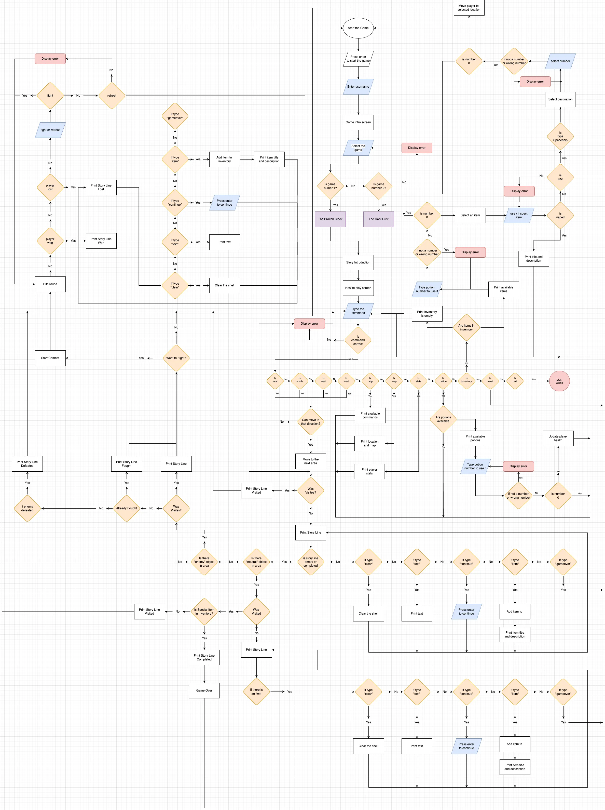
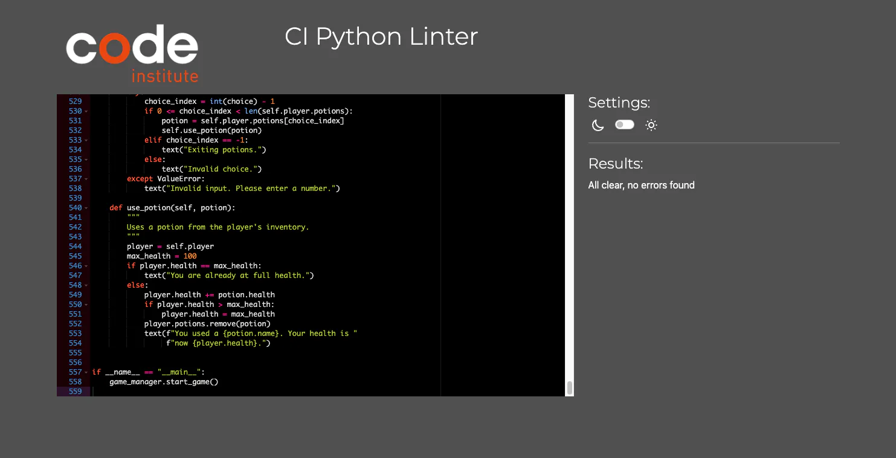
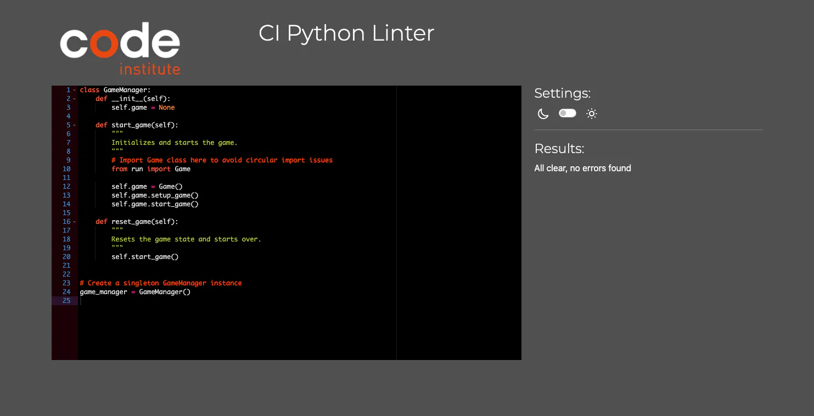
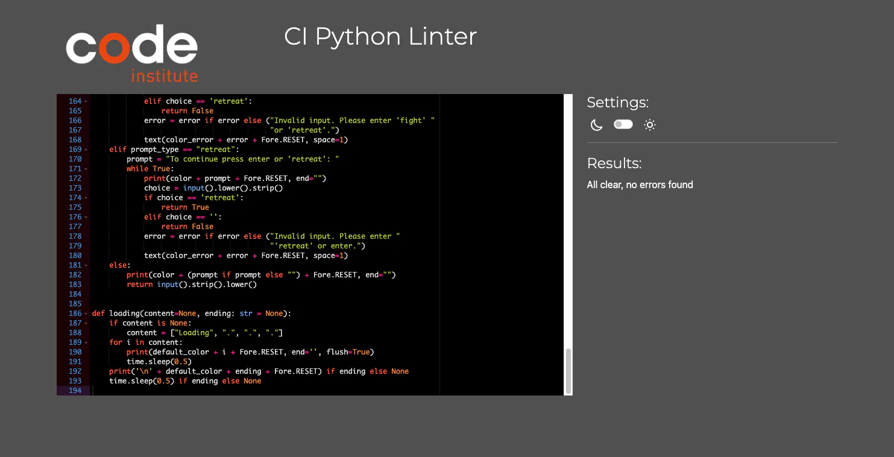
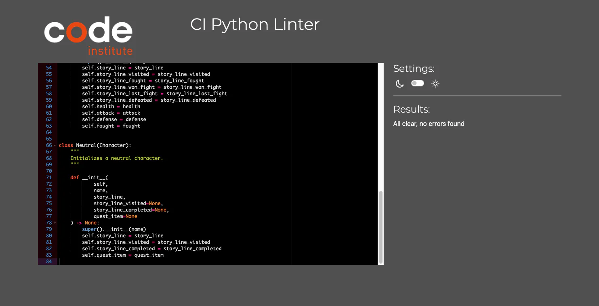
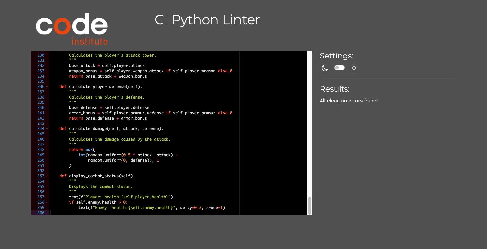
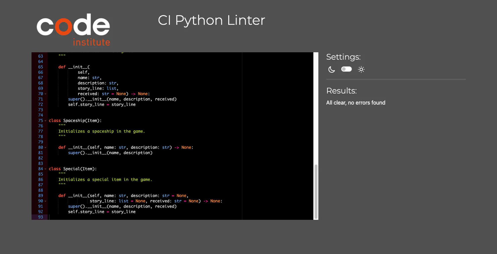
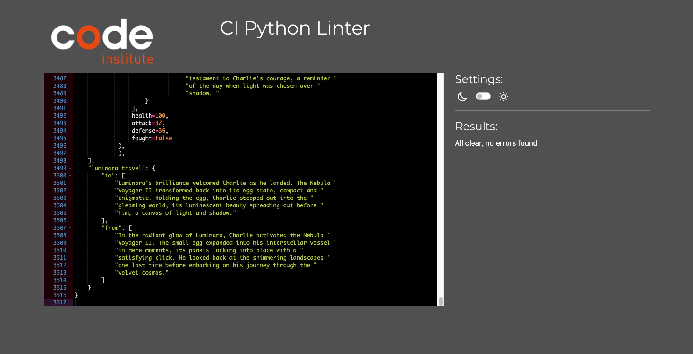

# Yolkaris Odyssey - CI Project 3<!-- omit from toc -->
version 1.0.3

Welcome to "Yolkaris Odyssey," my first attempt at coding a game. As a developer with a passion for learning and trying new things, I ventured into the realm of game development without a background in gaming. This project is a text-based adventure game built with Python, inspired by the classic games that have intrigued and entertained us over the years.

In "Yolkaris Odyssey," players embark on an epic journey through fantastical worlds, encountering diverse characters, and making decisions that shape the course of their adventure. I designed this game to challenge myself and to bring a simple yet captivating story to life through code. Join me in exploring the universe of Yolkaris, where every choice you make carves a path through the mysteries and wonders of this text-based adventure.


[Deployed Yolkaris Odyssey Game Link](https://yolkaris-odyssey-1ec6546cf850.herokuapp.com/)


## Table of Contents
- [Table of Contents](#table-of-contents)
- [Project Goals](#project-goals)
- [Player Goals](#player-goals)
- [User Stories](#user-stories)
- [Game flowchart](#game-flowchart)
- [Files and Folder Structure](#files-and-folder-structure)
- [Technology used](#technology-used)
- [Deployment and development](#deployment-and-development)
    - [Cloning the project](#cloning-the-project)
    - [Running the game in terminal](#running-the-game-in-terminal)
    - [Deploying the Game to Heroku](#deploying-the-game-to-heroku)
    - [Running the game with Docker](#running-the-game-with-docker)
        - [Installing Docker](#installing-docker)
        - [Building and Running the Docker Container](#building-and-running-the-docker-container)
- [How to play](#how-to-play)
    - [Game Commands](#game-commands)
- [Features](#features)
- [Testing](#testing)
    - [Manual Testing](#manual-testing)
- [Issues and Resolutions](#issues-and-resolutions)
    - [Unresolved Issues](#unresolved-issues)
- [Enhancements and Future Features](#enhancements-and-future-features)
- [Credits](#credits)
    - [Acknowledgements](#acknowledgements)

## Project Goals
[Back to Top](#table-of-contents)

The primary goal of creating "Yolkaris Odyssey" was to delve into the world of game development, leveraging my programming skills to build something fun, interactive, and engaging. I aimed to:

- **Explore Game Mechanics:** Learn the ins and outs of game design and development by creating a game from scratch.
- **Challenge My Coding Skills:** Push the boundaries of my Python knowledge by applying it to a completely new domain.
- **Engage Players with Storytelling:** Craft a compelling narrative that players can influence through their decisions, making each playthrough unique.

## Player Goals
[Back to Top](#table-of-contents)

"Yolkaris Odyssey" is designed with the player's enjoyment and engagement at the forefront. Players are encouraged to:

- **Embark on an Adventure:** Dive into the rich, text-based world of Yolkaris, filled with lore, mystery, and intrigue.
- **Make Meaningful Decisions:** Each choice you make affects the story's outcome. Shape your destiny in the universe of Yolkaris.
Solve Puzzles: Engage with puzzles and challenges that test your wit and reward your ingenuity.
- **Discover Hidden Secrets:** Explore thoroughly to uncover secrets and hidden storylines that enrich the game world.
This game is for anyone who loves the idea of embarking on an interstellar journey, enjoys narrative-driven experiences, and appreciates the charm of text-based adventures. Whether you're a seasoned gamer or new to this genre, "Yolkaris Odyssey" offers a welcoming and intriguing experience.

## User Stories
[Back to Top](#table-of-contents)

- As a player, I want to choose the type of game (quick adventure or full exploration) to select a gaming experience that matches my available time and interest level.
- As a player, I wish to move in a non-linear fashion, exploring the game world freely and making decisions on where to go next, ensuring my adventure feels personalized and unique.
- As a player, I'd like to interact with objects and characters in the game, allowing me to engage with the story more deeply and influence the outcome based on my choices.
- As a player, I need clear instructions and help options, so I can understand gameplay mechanics and what actions are available to me, ensuring a smooth and enjoyable experience.
- As a player, I desire a compelling narrative and well-developed characters, making the game immersive and emotionally engaging.
- As a player, I would like to engage in battles with enemies, having the option to either continue fighting or escape if the fight turns unfavorable, providing me with strategic choices that impact the game's outcome.
- As a player, I am interested in utilizing a variety of weapons and armor throughout the game, allowing me to customize my combat strategy and adapt to different types of enemies.
- As a player, I want a method to restore my character's health, such as using potions or finding rest areas, enabling me to recover from battles and continue my adventure.
- As a user, I want to explore various locations within the game, each with its own unique challenges and story elements, providing a rich and diverse world to discover.

## Game flowchart
[Back to Top](#table-of-contents)

Creating the flowchart for "Yolkaris Odyssey" helped me structure the game's complex elements, including combat, story progression, and exploration. I used draw.io for its user-friendly interface and comprehensive features, allowing me to map out the game from start to finish without restrictions. This detailed flowchart includes all player commands, the combat system, story interactions, and mechanics for traveling between locations. It was a crucial step in developing a clear, navigable game experience, ensuring players have a roadmap through their adventure in "Yolkaris Odyssey."

[Game Flowchart - PDF](./readme/yolkaris-odyssey-flowchart.pdf)



## Files and Folder Structure
[Back to Top](#table-of-contents)

During the development process, I initially had all the game logic written in a single file called `run.py`. However, upon receiving advice from my mentor, who recommended better organization, I decided to refactor the game. This led to the creation of a `game` folder, where I moved relevant classes into separate files, improving maintainability and readability.

- **characters.py**: Contains character classes such as `Character`, `Player`, `Enemy`, and `Neutral`.
- **items.py**: Includes the main `Item` class and its subclasses such as `Weapon`, `Armour`, and `Potions`.
- **locations.py**: Houses the main `Location` class and its related `Area` classes, defining various game environments.
- **interactions.py**: Contains classes related to game interactions, including `Interaction` and `Combat`.
- **game_manager.py**: Features a singleton class responsible for managing the game. It facilitates game initialization, as well as the ability to restart the game when needed.

In addition to the `game` folder, I also have a `utils` folder that includes:

- **text_utils.py**: Contains helper functions for manipulating text and aiding in game display and interaction.

This organizational structure has greatly improved the manageability of the game code and enhanced its readability.

## Technology used
[Back to Top](#table-of-contents)

- **HTML5 and CSS**: Used to customize the [Code Institute template](https://github.com/Code-Institute-Org/python-essentials-template).
- **Python**: The primary programming language used to develop this game.
- **Python Packages**:
  - **art**: Used for ASCII art generation.
  - **colorama**: Used for colored text output in the terminal.
- **Git and GitHub**: Used Git for version control, allowing for collaboration and tracking of code changes on GitHub.
- **Heroku**: Deployed the game on Heroku's server, making it accessible to anyone with an internet connection.
- **Docker**: Leveraged Docker for local testing of the game without the need to deploy to Heroku.
- **draw.io**: Used to create the game flowchart, aiding in visualizing the game's structure and logic.
- **Midjourney**: Used to create the main game image, which was also utilized as the background.
- **ChatGPT**: Utilized to enhance the game's storylines and narratives.
- **VSCode**: Mainly used as the primary text editor for writing the game code.
- **PyCharm**: Utilized for debugging code in real-time with breakpoints, as well as identifying warnings and errors.

## Deployment and development

### Cloning the project
[Back to Top](#table-of-contents)

1. Install Git: If you haven't already installed Git on your computer, download and install it from the Git website. Follow the installation instructions for your operating system.
2. Create project folder `mkdir yolkaris-odyssey`
3. Change to the project directory `cd yolkaris-odyssey`
4. Clone the repository `git clone https://github.com/patrickhladun/yolkaris-odyssey.git .`

### Running the game in terminal
[Back to Top](#table-of-contents)

1. Open your terminal and change directory to the cloned project folder.
2. Install the required packages with `pip install -r requirements.txt`
3. Run the game `python run.py`

### Deploying the Game to Heroku
[Back to Top](#table-of-contents)

1. Login or Create Heroku Account: If you don't have one, create a Heroku account. Otherwise, log in to your existing account.
2. Create New App: From the Heroku dashboard, click the "New" button in the top right corner. Select "Create new app" from the drop-down menu.
3. Name and Region Selection: Choose a unique name and select the region.
4. Configure Environment Variables: Navigate to the "Settings" tab and locate the "Config Vars" section. Click "Reveal config vars" to expose the configuration variables.
5. Add buildpacks: Navigate to Buildpack and click Add Buildpack to add Python and nodejs. Ensure that the python buildpack is above the Nodejs buildpack.
6. Deploy from GitHub: Navigate to the "Deploy" section by clicking the "Deploy" tab in the top navbar. Select "GitHub" as the deployment method and connect your GitHub repository by searching for its name in the search bar. Click "connect" to link the repository to Heroku.
7. Deploy Branch: Scroll down and click "Deploy Branch" to initiate the deployment process. Heroku will notify you once the app is deployed, and you'll be provided with a button to view the deployed app.

### Running the game with Docker
[Back to Top](#table-of-contents)

To enjoy this game locally, Docker provides a convenient way to do so. I've prepared a Dockerfile to facilitate building the necessary container. Follow these steps to build and run the Docker container:

#### Installing Docker
[Back to Top](#table-of-contents)

Firstly, ensure you have Docker installed on your system. You can download the appropriate version for your operating system from the official Docker website:
[Download Docker](https://docs.docker.com/get-docker/)

Alternatively, if you're using macOS or Linux and are familiar with Homebrew, you can install Docker using Homebrew with the following command:

```brew --cask install docker```

#### Building and Running the Docker Container
[Back to Top](#table-of-contents)

Once Docker is installed and running, proceed with the following steps:

1. Build the Container: This command creates a Docker image based on the instructions in the Dockerfile.

```docker build -t yolkaris-odyssey .```

- `docker build` command builds a Docker image.
- `-t yolkaris-odyssey` tags the image with the name "yolkaris-odyssey". You can replace this with any desired name.
- `.` the dot specifies the build context, which is the current directory where the Dockerfile is located.

2. Run the Container: This command runs the Docker container based on the built image, mapping port 3000 on the host to port 8000 within the container.

```docker run -p 3000:8000 yolkaris-odyssey```

- `docker run` command runs a Docker container.
- `-p 3000:8000` maps port 3000 on the host to port 8000 within the container. You can change the ports as needed.
- `yolkaris-odyssey` specifies the name of the Docker image to run as a container.

## How to play
[Back to Top](#table-of-contents)

Embark on an epic journey in Yolkaris Odyssey, a captivating text-based adventure game set in the vibrant world of Yolkaris. Uncover hidden mysteries, tackle thrilling quests, and endeavor to restore the Grand Clock to its former glory. Here's how to kickstart your adventure:

1. **Enter Your Name**: Begin by typing in your name when prompted. This will personalize your journey through the game.

2. **Choose Your Adventure**: Upon entering the game, you'll encounter a screen where you must select your desired adventure:

    - **The Broken Clock**: Engage in a concise yet action-packed adventure set in a single location. Prepare for intense combat as you endeavor to save Yolkaris from impending doom.
    
    - **The Dark Dust**: Dive into a more extensive adventure spanning three distinct locations. Traverse the vast landscapes of Yolkaris as you confront a new threat endangering the planet. Keep in mind that the game lacks a save option, so strategize wisely! If you meet your demise later in the game, you'll need to restart from the beginning. Play smart, and may fortune favor you on your quest!

### Game Commands

- `map`: Displays the map of your current location, showing areas you can explore.
- `north`: Move to the area north of your current location.
- `south`: Move to the area south of your current location.
- `east`: Move to the area east of your current location.
- `west`: Move to the area west of your current location.
- `stats`: View your character's health, attack, defense, and other vital stats.
- `inventory`: Access the items you've collected on your journey. Here, you can inspect items or use them.
- `potion`: Displays your potion options. Use this command when you need to restore health.
- `search`: Investigate your current location for hidden items or secrets.
- `reset`: Resets the game, allowing you to start over from the main screen.

## Features
[Back to Top](#table-of-contents)

- **Rich Storyline:** Embark on a thrilling adventure as Charlie, a courageous chicken determined to save the planet Yolkaris from the encroaching Dark Dust. Explore a narrative filled with cosmic mysteries, ancient lore, and a quest for the legendary Aurora Orb.
- **Diverse Locations:** Travel across three beautifully rendered planets, each with its own unique ecosystems, challenges, and secrets. From the vibrant Yolkaris to the mysterious Mystara and the radiant Luminara, immerse yourself in diverse settings.
- **Interactive Gameplay:** Engage in a dynamic world with interactive elements. Communicate with NPCs, make critical decisions that affect your journey, and face moral dilemmas that test your resolve.
- **Combat System:** Encounter various enemies, from rogue guardians to celestial protectors gone awry. Utilize a strategic combat system to overcome adversaries, using a combination of strength, strategy, and special items.
- **Inventory Management:** Collect items, weapons, and special artifacts that aid in your quest. Manage your inventory wisely to ensure you're prepared for the challenges ahead.
- **Character Progression:** Develop Charlie’s abilities as you progress, enhancing his health, attack, and defense through encounters and discoveries. Equip him with unique armor and weapons to increase his chances of survival.
- **Easter Eggs and Humor:** Discover easter eggs and humorous elements that lighten the mood, including references to popular culture and light-hearted interactions with characters.
- **Non-linear Exploration:** Enjoy the freedom to explore the game’s universe in a non-linear fashion. Choose which quests to pursue and which areas to explore first, making each playthrough uniquely yours.

## Testing
[Back to Top](#table-of-contents)

To ensure the code is aligned with PEP8 standards, I have use PyCharms built-in PEP8 compliance checker. I've also utilized the [Code Institute Python Linter](https://pep8ci.herokuapp.com/) to confirm that the code is compliant with PEP8 standards. This has helped me maintain a consistent coding style and structure throughout the project. 

<details><summary>run.py PEP8 Compliance</summary>



</details>

<details><summary>game_manager.py PEP8 Compliance</summary>



</details>

<details><summary>text_utils.py PEP8 Compliance</summary>



</details>

<details><summary>characters.py PEP8 Compliance</summary>



</details>

<details><summary>interactions.py PEP8 Compliance</summary>



</details>

<details><summary>items.py PEP8 Compliance</summary>



</details>

<details><summary>locations.py PEP8 Compliance</summary>



</details>

### Manual Testing

I've dedicated significant time to thoroughly testing its various aspects through manual playtesting. With a focus on ensuring a smooth user experience, I've meticulously explored each feature and scenario within the game.

Throughout the testing process, I've placed particular emphasis on input error handling to prevent users from encountering frustrating dead ends or lack of feedback. Every user interaction has been carefully considered to ensure that players always have the option to quit or cancel their selections, providing a seamless and intuitive gameplay experience.

Having played the game extensively myself, I've personally verified its functionality and stability across multiple playthroughs. This manual testing approach has allowed me to identify and address any potential issues, ensuring that players can enjoy the game without encountering unexpected obstacles.

|Test scenario|Steps to reproduce|Observation|Outcome|
|-------------|------------------|-----------|-------|
|||||
|Starting the game|On the main game screen, press enter|After pressing enter, game stats and asks for a username|Works as expected|
|Providing the username|Type the correct username between 3 and 24 characters|Game prints the game intro starting with "hello [username]"|Works as expected|
|Username error handling|Provide too long, too short, or no username|Error is printed: "Invalid username. It should be between 3 to 24 characters, contain only letters and numbers, and no underscores."|Works as expected|
|Select a game from available games|Type the correct number of available game from the list|The selected game is initiated, game loading screen displayed, initial location and area story_line is printed|Works as expected|
|Handle wrong input for the game selection|Type the wrong number or any other character|Error is printed: Invalid choice. Please select a correct number.|Works as expected|
|Moving around the map|Type east, south, west, or north|Player moves to the next Area|Works as expected|
|Moving to a direction where there is no area|Type east, south, west, or north|If there is no area in the selected direction, "You can't move in that direction." is shown|Works as expected|
|Display the map|Type "map" in the console|The map is printed|Works as expected|
|Display player stats|Type "stats"|The stats are printed|Works as expected|
|Reset the game to the main screen|Type "restart"|The game is restarted, and the welcome screen is printed|Works as expected|
|Display available commands|Type "help" in the console|Available commands are printed|Works as expected|
|Search the area|Type "search" in the console|If there are available items, they are printed, and "Select an item number to interact with" is shown. If there are no items, "You searched the area but found nothing." is shown|Works as expected|
|Quit searching the area|Type "0" to quit the item list|Game quits the list of the items to pick|Works as expected|
|Handle wrong input on the items list|Type anything else aside from the correct item number or "0"|Error is printed: Invalid choice. Please select a correct number.|Works as expected|
|Select item to pick|Select the item to pick up by its number from the list|"Do you want to take it? (y/n):" is printed to give an option to pick the item or not|Works as expected|
|Pick the item|Type "yes" or "y" to the "Do you want to take it? (y/n):" question and press enter|The item is picked up, and a message is printed: "You have added the Medium Potion to your inventory."|Works as expected|
|Do not pick the item|Type "no" or "n" to the "Do you want to take it? (y/n):" question|Game goes back to the console and is ready to type commands|Works as expected|
|Handle wrong input in picking the item|Type anything else aside from "y" or "n"|Error is printed: "Invalid input. Please enter 'yes' or 'no'."|Works as expected|
|Accessing potions|Type "potion" to access the potions list and press enter|If no potions are available, "no potions available" will be printed. If potions are available, a list of potions is printed|Works as expected|
|Handle wrong input in selecting the potion|Type anything else aside from the item number or "0" and press enter|Error is printed: Invalid choice. Please select a correct number.|Works as expected|
|Use the potion|Select the potion number from the list and press enter|If player health is 100, potion is not used. If the health is less than 100, potion is used. It adds to the health but no more than 100. The potion is removed from the potions list.|Works as expected|
|Open the inventory|Type "inventory" or "i"|If no items in the inventory, "no items in inventory" message is printed. If there are items, they are printed as a numbered list, and "Select an item number to interact with, or type '0' to cancel:" input is printed|Works as expected|
|Handle wrong input in selecting the item|Type anything else aside from the item number or "0" and press enter|Error is printed: Invalid choice. Please select a correct number.|Works as expected|
|Selecting inventory item|Type the corresponding item number and press enter|"Do you want to 'use' or 'inspect' the item? (u/i):" is printed|Works as expected|
|Handle wrong input in use or inspect question|Type anything else aside from "u", "i", or "0"|Error is printed: Invalid input. Please enter 'u' to use, 'i' to inspect the item or '0' to cancel.|Works as expected|
|Inspect the item|Type "i" to the "Do you want to 'use' or 'inspect' the item? (u/i):" question and press enter|The item title and description is printed|Works as expected|
|Use the item|Type "u" to the "Do you want to 'use' or 'inspect' the item? (u/i):" question and press enter|The item story_line is printed|Works as expected|
|Exit the item options|Type "0" to cancel the use of the item|Exits the options and prints "Exiting inventory."|Works as expected|
|Use Spaceship|Select the spaceship from inventory and use it|The list of available destinations is printed, and "Where do you want to go? (type '0' to quit)" prompt is shown|Works as expected|
|Handle wrong input for spaceship|Type anything aside from the destination corresponding number and '0'|Error is printed: Invalid choice. Please select a correct number.|Works as expected|
|Travel to a new destination|Select the destination with the corresponding number and press enter|Actual location travel from text is printed, travel is simulated by printing stars, destination location travel to text is printed, player's location is updated, and area's story_line in position (0,0) is printed or story_line_visited if already visited|Works as expected|
|Handle wrong input in combat question|Type anything other than 'fight' or 'retreat'|Error is printed: Invalid input. Please enter 'fight' or 'retreat'.|Works as expected|
|Retreat from the initial fight|Type "retreat" to Do you want to 'fight' or 'retreat'?|Player retreats from the fight and move to previous area|Works as expected|
|Start the combat|Type "fight" to Do you want to 'fight' or 'retreat'?|The combat is initiated, player hits enemy, enemy hits player round|Works as expected|
|Retreat from ongoing combat|Type "retreat" to "To continue press enter or 'retreat':"|Player retreats from the fight and move to previous area|Works as expected|
|Continue the combat|Type enter to continue|Next round is initiated, player hits enemy, enemy hits player round|Works as expected|
|Losing the combat|In the round player gets hit and health goes to 0 or below|story_line_lost is printed and game is over|Works as expected|
|Winning the combat|In the round player hits enemy and enemy health goes to 0 or below|story_line_win is printed and user stays in the area|Works as expected|

## Issues and Resolutions
[Back to Top](#table-of-contents)

- Repetitive Code Warning: While working on the add_new_item method, I encountered a warning about repeated code. To address this, I refactored the method by introducing a new equip method within the Interaction class. This new method handles the logic of equipping the player with items, resulting in cleaner and more maintainable code.

<details><summary>Original `add_new_item` Method with Repeated Code</summary>

```python
...
    def add_new_item(self, item):
        """
        Adds a new item to the player's inventory.
        """
        if isinstance(item, Weapon):
            if item.name == 'none':
                self.player.weapon = None
                return
            if item.received:
                paragraph(f"{item.received}", space=1)
            else:
                paragraph(f"You have received the '{item.name}'.", space=1)
            if item.description:
                paragraph(item.description, space=1)
            self.player.weapon = item

        elif isinstance(item, Armour):
            if item.name == 'none':
                self.player.armour = None
                return
            if item.received:
                paragraph(f"{item.received}", space=1)
            else:
                paragraph(f"You have received '{item.name}'.", space=1)
            if item.description:
                paragraph(item.description, space=1)
            self.player.armour = item
...
```
</details>

<details><summary>Refactored `add_new_item` Method with `equip` Method</summary>

```python
...
    def equip(self, item, item_type):
        """
        Equips the player with the item.
        """
        if item.name == 'none':
            setattr(self.player, item_type, None)
            return
        if item.received:
            paragraph(f"{item.received}", space=1)
        else:
            msg = f"You have received '{item.name}'." if item_type == 'armour' else f"You have received the '{item.name}'."
            paragraph(msg, space=1)
        if item.description:
            paragraph(item.description, space=1)
        setattr(self.player, item_type, item)

    def add_new_item(self, item):
        """
        Adds a new item to the player's inventory.
        """
        if isinstance(item, Weapon):
            self.equip(item, 'weapon')

        elif isinstance(item, Armour):
            self.equip(item, 'armour')
...
```
</details>

- During the story development process, I encountered the need to split long lines of text to fit within the 79-character limit. To address this, I alternated between using a small script I developed called [py-split](https://github.com/patrickhladun/py-split) and PyCharm's "Fill Paragraph" quick fix feature when the "PEP 8: E501 line too long" warning appeared. However, I found that PyCharm's quick fix did not always produce the desired results, prompting me to rely more heavily on py-split to accurately split the text into multiple lines.

- This is a text-based game where I needed precise formatting of text in the console. To achieve this, I developed two helper functions: text and paragraph. 

<details><summary>text Function (for printing short text)</summary>

```python
def text(
        text_line,
        delay=0.1,
        space=0,
        color=default_color
):
    """
    Prints text to the terminal with optional color.
    - text: the text to print
    - delay: the delay between each character
    - space: the number of new lines to print after the text
    - color: the color to apply to the text
    """
    line_space = '\n' * space
    colored_text = (color + text_line if color else text_line) + \
        Fore.RESET + line_space
    print(colored_text)
    time.sleep(delay)
```
</details>

<details><summary>paragraph Function (for printing long text and breaking it to fit the console width)</summary>

```python
def paragraph(
        long_string,
        space=0,
        delay=0.1,
        color=default_color
):
    """
    Prints a paragraph of text to the terminal with optional color.
    - long_string: the text to wrap and print as a paragraph
    - space: the number of new lines to print after the paragraph
    - color: the color to apply to the text
    """
    wrapped_text = textwrap.fill(long_string, width=74)
    lines = wrapped_text.split('\n')

    text(' ' * 3 + lines[0], color=color)

    for i in range(1, len(lines)):
        line = lines[i]
        if i == len(lines) - 1:
            text(line, color=color)
        else:
            text(line, color=color)

    add_space(space=space, delay=delay)
```
</details>

- The game needed player input in many places and proper error handling. To sort this out I developed a helper function called `ask_user` that handles the input and error handling in different area of the game. This make sure errors are consistent and relevant to the user input.

<details><summary>ask_user Function (for handling user input and error handling)</summary>

```python
...
def ask_user(
        prompt_type: str = None,
        color=color_ask_user,
        prompt: str = None,
        error: str = None,
        space: int = 0,
        numbers=None
):
    """
    Prompts the user for input with an optional color.
    - type: the type of prompt ('continue' or 'confirm')
    - color: the color to apply to the prompt text
    - prompt: the prompt text to display (optional)
    """
    if numbers is None:
        numbers = ['1', '2']
    if prompt_type == "continue":
        prompt = prompt if prompt else "Press enter to continue: "
        line_space = '\n' * (space - 1) if space > 0 else ''
        print(color + prompt + Fore.RESET, end="")
        input().strip().lower()
        if space > 0:
            print(line_space)
    elif prompt_type == "number":
        while True:
            prompt = prompt if prompt else "Select a number: "
            print(color + prompt + Fore.RESET, end="")
            choice = input().strip()
            if choice in numbers:
                return int(choice)
            elif choice == '0':
                return 0
            else:
                error = error if error else ("Invalid choice. Please select a "
                                             "correct number.")
                text(color_error + error + Fore.RESET, space=1)
    elif prompt_type == "game":
        while True:
            prompt = prompt if prompt else "Select a game: "
            print(color + prompt + Fore.RESET, end="")
            choice = input().strip()
            if choice in numbers:
                return int(choice)
            error = error if error else ("Invalid choice. Please select a "
                                             "correct number.")
            text(color_error + error + Fore.RESET, space=1)
                
    elif prompt_type == "confirm":
        prompt = prompt if prompt else "Select 'yes' or 'no': "
        while True:
            print(color + prompt + " (y/n): " + Fore.RESET, end="")
            choice = input().lower().strip()
            if choice in ['yes', 'y']:
                return True
            elif choice in ['no', 'n']:
                return False
            error = error if error else ("Invalid input. Please enter 'yes' "
                                         "or 'no'.")
            text(color_error + error + Fore.RESET, space=1)
    elif prompt_type == "item":
        prompt = prompt if prompt else ("Do you want to 'use' or 'inspect' "
                                        "the item? (u/i), type '0' to cancel:")
        while True:
            print(color + prompt + Fore.RESET, end="")
            choice = input().lower().strip()
            if choice in ['use', 'u', 'inspect', 'i', '0']:
                return choice
            error = error if error else ("Invalid input. Please enter 'u' to "
                                         "use, 'i' to inspect the item or "
                                         "'0' to cancel.")
            text(color_error + error + Fore.RESET, space=1)
    elif prompt_type == "combat":
        prompt = "Do you want to 'fight' or 'retreat'? "
        while True:
            print(color + prompt + Fore.RESET, end="")
            choice = input().lower().strip()
            if choice == 'fight':
                return True
            elif choice == 'retreat':
                return False
            error = error if error else ("Invalid input. Please enter 'fight' "
                                         "or 'retreat'.")
            text(color_error + error + Fore.RESET, space=1)
    elif prompt_type == "retreat":
        prompt = "To continue press enter or 'retreat': "
        while True:
            print(color + prompt + Fore.RESET, end="")
            choice = input().lower().strip()
            if choice == 'retreat':
                return True
            elif choice == '':
                return False
            error = error if error else ("Invalid input. Please enter "
                                         "'retreat' or enter.")
            text(color_error + error + Fore.RESET, space=1)
    else:
        print(color + (prompt if prompt else "") + Fore.RESET, end="")
        return input().strip().lower()
...
```
</details>

### Unresolved Issues

- [Issue 1 - Input execution timing issue during text output](https://github.com/patrickhladun/yolkaris-odyssey/issues/1)

## Enhancements and Future Features
[Back to Top](#table-of-contents)

As Yolkaris Odyssey evolves, here are some exciting features and enhancements that could elevate the gaming experience:

1. **Player Accounts**: Introduce a player account system to allow users to save their progress, earn achievements, and track their in-game accomplishments over time.
2. **Saving Game State**: Implement a saving mechanism to allow players to save their current game progress and resume their adventure at a later time.
3. **Character Creation and Attributes**: Expand character customization options by introducing a character creation system. Players can define attributes such as stamina, intelligence, luck, mana, and more, influencing their gameplay experience and decision-making abilities.
4. **Larger and More Diverse Locations**: Enrich the world of Yolkaris with a variety of captivating locations to explore. From bustling cities to mysterious forests and treacherous dungeons, offer players a diverse range of environments to immerse themselves in.
5. **Quests and Storylines**: Introduce compelling quests and storylines that unfold dynamically based on player choices and actions. From epic battles to intricate puzzles, provide engaging challenges that keep players invested in the narrative.
6. **NPC Interactions**: Enhance player immersion by incorporating rich NPC interactions. Allow players to engage in meaningful conversations with characters inhabiting the world of Yolkaris, each with their own stories, quests, and personalities.
7. **Crafting and Trading**: Introduce crafting mechanics that enable players to gather resources, craft items, and trade with other characters. From potions and weapons to rare artifacts, offer a wide array of crafting options to empower players in their journey.
8. **Dynamic Events and Challenges**: Spice up the gameplay experience with dynamic events and challenges that occur spontaneously throughout the game world. From sudden enemy invasions to hidden treasure hunts, keep players on their toes with unexpected surprises.
9. **Companions and Allies**: Allow players to recruit companions and allies to aid them in their adventures. From loyal pets to skilled mercenaries, offer a diverse roster of characters that players can enlist to accompany them on their quests.
10. **Player-driven Economy**: Create a player-driven economy where players can buy, sell, and trade goods with one another. Establish marketplaces, auction houses, and trading posts where players can interact and exchange resources, fostering a vibrant in-game economy.

By incorporating these features and enhancements, Yolkaris Odyssey can evolve into a rich and immersive text-based adventure game that captivates players and keeps them coming back for more.

## Credits
[Back to Top](#table-of-contents)

- [code institute template](https://github.com/Code-Institute-Org/python-essentials-template) to start the project
- [code institute CI Python Linter](https://pep8ci.herokuapp.com/) to check the code for PEP8 compliance
- [imgbb](https://imgbb.com/) for hosting the game image

### Acknowledgements
[Back to Top](#table-of-contents)

- My mentor, Precious Ijege for providing me with advice on breaking the code to multiple files
- My kids for playing the game and showing me all the errors ;)